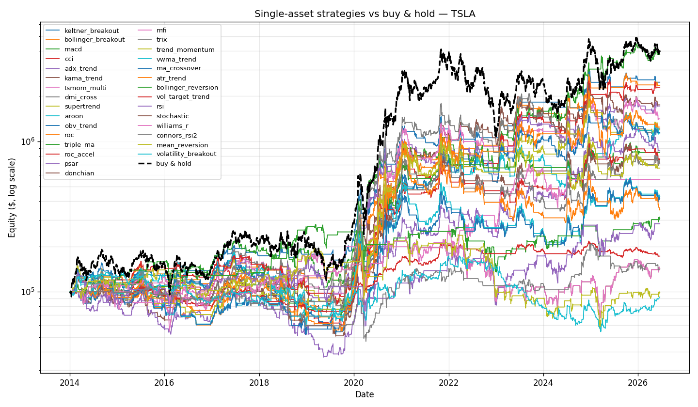

# Measured results

All numbers are from this engine with realistic costs (5 bps slippage per fill, a
1%-of-equity no-trade band) and **no look-ahead** (decide on a bar's close, fill
on the next bar's open). Default parameters — no tuning — so nothing here is
cherry-picked. Reproduce with the commands shown. **In-sample, default-parameter
results are a hypothesis, not a forecast; validate any winner with `walkforward.py`.**

> The drawdown kill switch is OFF by default (it permanently flattens a backtest
> once tripped, which is a live-trading safety, not a research tool). See
> `engine/risk.py`.

---

## 1. Single-asset strategies on SPY, 2008–today (all 30)

`python compare.py --symbols SPY --start 2008-01-01 --plot`

| strategy | CAGR | Sharpe | MaxDD | Return | family |
|----------|-----:|-------:|------:|-------:|--------|
| `atr_trend` | 9.2% | **0.85** | 16.7% | 409% | trend+ |
| `vol_target_trend` | 8.5% | 0.82 | 17.4% | 352% | trend+ |
| `supertrend` | 8.1% | 0.82 | 14.1% | 322% | trend |
| `roc` | 8.8% | 0.77 | 19.8% | 375% | momentum |
| `aroon` | 7.9% | 0.74 | 15.8% | 306% | trend |
| `trend_momentum` | 7.3% | 0.68 | 24.5% | 268% | trend |
| **`buy_and_hold`** | **11.3%** | 0.64 | **51.9%** | **623%** | benchmark |
| `trix` | 6.9% | 0.63 | 21.5% | 245% | momentum |
| `ma_crossover` | 6.8% | 0.60 | 28.1% | 236% | trend |
| `tsmom_multi` | 6.1% | 0.60 | 21.1% | 199% | momentum |
| `vwma_trend` | 6.2% | 0.56 | 29.2% | 204% | volume |
| `donchian` | 4.8% | 0.56 | 19.8% | 137% | trend |
| `triple_ma` | 4.9% | 0.55 | 15.9% | 143% | trend |
| `dmi_cross` | 5.2% | 0.54 | 17.1% | 153% | trend |
| `mfi` | 6.6% | 0.46 | 47.8% | 225% | volume |
| `adx_trend` | 3.9% | 0.46 | 17.6% | 102% | trend |
| `cci` | 3.8% | 0.43 | 27.9% | 98% | trend |
| `macd` | 4.3% | 0.43 | 23.3% | 119% | trend |
| `rsi` | 5.6% | 0.42 | 47.4% | 175% | reversion |
| `stochastic` | 5.5% | 0.42 | 39.4% | 170% | reversion |
| `williams_r` | 5.5% | 0.42 | 39.4% | 170% | reversion |
| `bollinger_reversion` | 3.8% | 0.34 | 35.6% | 100% | reversion |
| `keltner_breakout` | 2.2% | 0.34 | 15.1% | 48% | trend |
| `mean_reversion` | 3.3% | 0.29 | 37.1% | 81% | reversion |
| `roc_accel` | 1.7% | 0.25 | 21.8% | 37% | momentum |
| `connors_rsi2` | 1.2% | 0.21 | 25.6% | 25% | reversion |
| `psar` | 1.7% | 0.20 | 45.8% | 37% | trend |
| `kama_trend` | 1.6% | 0.20 | 38.1% | 35% | trend |
| `obv_trend` | 1.3% | 0.17 | 40.5% | 26% | volume |
| `bollinger_breakout` | 0.8% | 0.16 | 22.4% | 16% | trend |
| `volatility_breakout` | -5.6% | -0.64 | 68.0% | -66% | trend (broken on daily) |

**Beat buy & hold on Sharpe:** `atr_trend`, `vol_target_trend`, `supertrend`,
`roc`, `aroon`, `trend_momentum`. **Beat it on raw return:** none.

Reading it: the **trend/momentum family wins on risk** — the best (`atr_trend`)
roughly *triples* buy-and-hold's risk efficiency on drawdown (17% vs 52%) at a
similar Sharpe — but **none beat buy-and-hold on raw return**, because SPY mostly
went up and any strategy that sometimes sits in cash gives up upside. The
reversion strategies mostly lose on an index that trends up. Two notes on the new
additions: the **volume** strategies (`obv_trend`, `vwma_trend`, `mfi`) are
middling-to-poor on a broad index — volume signals tend to add more on individual
stocks than on SPY — and `williams_r` ties `stochastic` exactly because at these
thresholds they are the same oscillator shifted by a constant.
`volatility_breakout` is an intraday idea that is simply wrong on daily bars (note
the trade count and −66% return — a cautionary example, left in on purpose).

---

## 2. Everything on a diversified universe, 2007–today

`python compare.py --symbols SPY QQQ EFA EEM TLT GLD --start 2007-01-01 --plot`
(single-asset strategies are applied equal-weight per symbol; rotation strategies
allocate across the whole universe; benchmark is equal-weight buy & hold.)

Top of the table by Sharpe:

| strategy | CAGR | Sharpe | MaxDD | Return | type |
|----------|-----:|-------:|------:|-------:|------|
| `roc` | 7.0% | **0.82** | 11.6% | 271% | single |
| `inverse_vol` | 9.6% | 0.82 | 29.9% | 499% | **rotation** |
| `trend_momentum` | 6.2% | 0.79 | 10.2% | 223% | single |
| **`buy_and_hold`** | 10.4% | 0.76 | 37.2% | 580% | benchmark |
| `vol_target_trend` | 6.0% | 0.73 | 12.2% | 210% | single |
| `atr_trend` | 5.4% | 0.69 | 13.1% | 179% | single |
| `ew_trend` | 7.9% | 0.66 | 22.5% | 337% | **rotation** |
| `dual_momentum` | **10.8%** | 0.61 | 34.6% | **640%** | **rotation** |
| `relative_momentum` | 7.8% | 0.54 | 39.8% | 329% | rotation |

**Beat buy & hold on Sharpe:** `roc`, `inverse_vol`, `trend_momentum`.
**Beat it on raw return:** `dual_momentum` (the only one).

---

## 3. Rotation head-to-head vs equal-weight buy & hold, 2007–today

`python rotate.py --strategy dual_momentum --safe TLT` (universe: SPY QQQ EFA EEM
TLT GLD, monthly rebalance)

| strategy | CAGR | Sharpe | MaxDD | vs buy & hold |
|----------|-----:|-------:|------:|---------------|
| `dual_momentum` | **10.8%** | 0.61 | 34.6% | ✅ beats on **both** return (10.8 vs 10.4) and drawdown (34.6 vs 37.2) |
| `inverse_vol` | 9.6% | **0.82** | 29.9% | 🛡 best Sharpe; beats on Sharpe + drawdown, slightly less return |
| `ew_trend` | 7.9% | 0.66 | 22.5% | 🛡 shallowest drawdown; less return |
| `relative_momentum` | 7.8% | 0.54 | 39.8% | ❌ lost on both |
| `buy_and_hold` (EW) | 10.4% | 0.76 | 37.2% | benchmark |

---

## 4. Regime dependence — the same strategies on a volatile stock (TSLA), 2014–today

`python compare.py --symbols TSLA --start 2014-01-01 --plot`

The single most important result in this repo. TSLA buy-and-hold returned **3,902%**
(a 40× monster) at a stomach-destroying **73.6% max drawdown**. The same 30
strategies, unchanged, produce a *completely different* ranking than on SPY:

| strategy | family | TSLA Sharpe | TSLA MaxDD | TSLA Return | …its **SPY** Sharpe |
|----------|--------|------------:|-----------:|------------:|--------------------:|
| `keltner_breakout` | trend | **0.98** | 34% | 2375% | 0.34 |
| `bollinger_breakout` | trend | **0.97** | 37% | 2249% | 0.16 |
| `macd` | trend | 0.94 | 51% | 3688% | 0.43 |
| `cci` | trend | 0.88 | 60% | 2174% | 0.43 |
| `adx_trend` | trend | 0.81 | 48% | 1620% | 0.46 |
| **`buy_and_hold`** | — | 0.81 | **74%** | **3902%** | 0.64 |
| `obv_trend` | volume | 0.69 | 69% | 1041% | 0.17 |
| `mfi` | volume | 0.60 | 49% | 459% | 0.46 |
| `mean_reversion` | reversion | 0.18 | 76% | -1% | 0.29 |
| `williams_r` / `stochastic` | reversion | 0.27 | 71% | 42% | 0.42 |

Three findings that did NOT appear on SPY:

1. **Performance is wildly regime-dependent.** The two breakout strategies that
   ranked near the *bottom* on choppy SPY (`bollinger_breakout` 0.16,
   `keltner_breakout` 0.34) are the *top two* on explosively-trending TSLA (0.97,
   0.98) — same code, opposite verdict, purely because of the asset's character.
   This is the entire reason `compare.py` exists: never assume a strategy that won
   on one asset wins on another.
2. **The volume strategies came alive** — `obv_trend` 0.17 → **0.69**, `mfi` 0.46
   → **0.60**. Volume signals genuinely add more on a single stock than on a broad
   index, as predicted.
3. **Reversion still lost** (`mean_reversion` −0.1%, `stochastic`/`williams_r`
   0.27) — counterintuitive for a "volatile" stock, but TSLA's volatility was
   *trending*, not *ranging*. Fading a 40× rocket loses; reversion needs an asset
   that chops sideways, not one that goes vertical.

Net: on a trending stock the trend/breakout family captured ~60% of buy-and-hold's
return with roughly **half the drawdown** — a ride a human could actually hold.
Match the strategy to the asset's behavior; that's more of the skill than picking
"the best strategy."

## The honest bottom line

- **Does anything beat buy-and-hold?** On **risk-adjusted** terms, yes — several
  trend/momentum strategies and `inverse_vol` beat it on Sharpe and halve the
  drawdown. On **raw return**, only `dual_momentum` (cross-asset rotation) did,
  and it paid for that return with a lower Sharpe and a 35% drawdown (it holds one
  concentrated asset at a time).
- **Why rotation can do what single-asset timing can't:** when stocks fall it
  rotates into bonds/gold instead of sitting in cash, so it keeps compounding.
  That's the one structural edge in this whole repo.
- **There is no free lunch.** Every strategy that lowered drawdown also lowered
  return; the only question is which trade-off you can actually live with. None of
  this is a money printer, and these are in-sample default-parameter numbers.
- **Before trusting any winner:** run `walkforward.py` on it (out-of-sample),
  check it on other assets/periods, then paper-trade for months. A strategy that
  only wins on one ticker over one window is luck, not edge.
